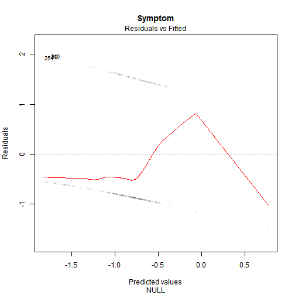
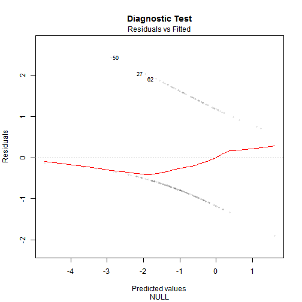

Exploring ML Techniques for Diagnosis of Malignant Mesothelioma
========================================================
author: RM
date: Sun Jun 26 11:54:57 2016
autosize: true

Overview
========================================================

Malignant mesothelioma (MM) is aggressive tumor of lungs, which results from exposure to mineral fibers. The objective in this presentation is to explore the MM hospital report data using machine learning techniques to target disease diagnosis.

Introduction: select a subcategory of the data and fit a model with general linear model (GLM) technique.

- Explore the data by symptom
- Explore the data by diagnostic test

Method & Associated Statistics
========================================================

Method General linear Model (GLM).


```
Confusion Matrix and Statistics

          Reference
Prediction  1  2
         1 58 23
         2  0  0
                                         
               Accuracy : 0.716          
                 95% CI : (0.605, 0.8107)
    No Information Rate : 0.716          
    P-Value [Acc > NIR] : 0.5559         
                                         
                  Kappa : 0              
 Mcnemar's Test P-Value : 4.49e-06       
                                         
            Sensitivity : 1.000          
            Specificity : 0.000          
         Pos Pred Value : 0.716          
         Neg Pred Value :   NaN          
             Prevalence : 0.716          
         Detection Rate : 0.716          
   Detection Prevalence : 1.000          
      Balanced Accuracy : 0.500          
                                         
       'Positive' Class : 1              
                                         
```

```
Confusion Matrix and Statistics

          Reference
Prediction  1  2
         1 52 19
         2  6  4
                                          
               Accuracy : 0.6914          
                 95% CI : (0.5789, 0.7893)
    No Information Rate : 0.716           
    P-Value [Acc > NIR] : 0.7346          
                                          
                  Kappa : 0.085           
 Mcnemar's Test P-Value : 0.0164          
                                          
            Sensitivity : 0.8966          
            Specificity : 0.1739          
         Pos Pred Value : 0.7324          
         Neg Pred Value : 0.4000          
             Prevalence : 0.7160          
         Detection Rate : 0.6420          
   Detection Prevalence : 0.8765          
      Balanced Accuracy : 0.5352          
                                          
       'Positive' Class : 1               
                                          
```

Results & Plots
========================================================

Results predicted values versus residuals.



Conclusion
========================================================

Conclusion: the results of this presentation demonstrate an exploration of differences between two examples of subsets of data.  

- Selection by symptom
- Selection by diagnostic test

Reference

An approach based on probabilistic neural network for diagnosis of Mesothelioma's disease 
By: Er, Orhan; Tanrikulu, Abdullah Cetin; Abakay, Abdurrahman; et al. 
COMPUTERS & ELECTRICAL ENGINEERING Volume: 38 Issue: 1 Pages: 75-81 Published: JAN 2012 


